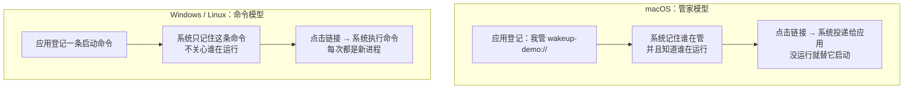
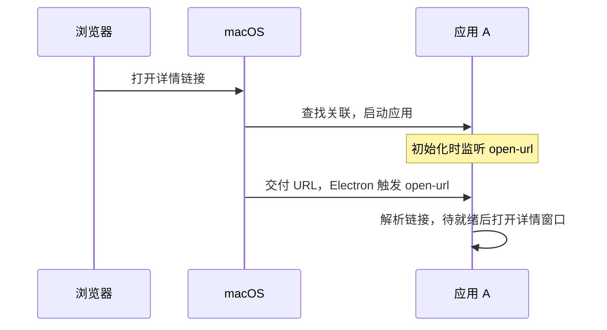
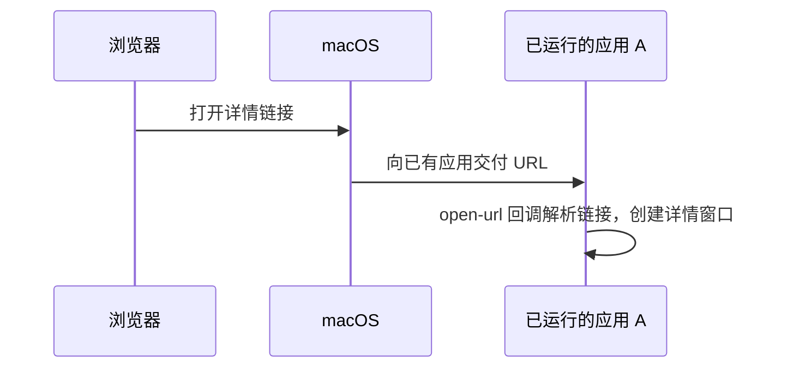
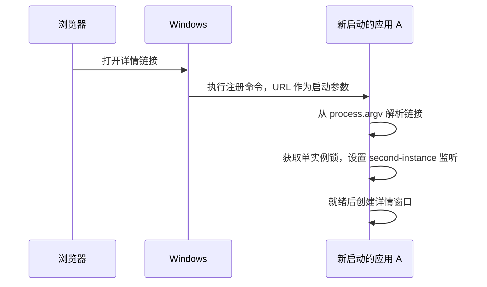
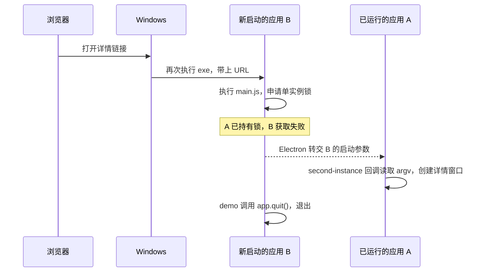
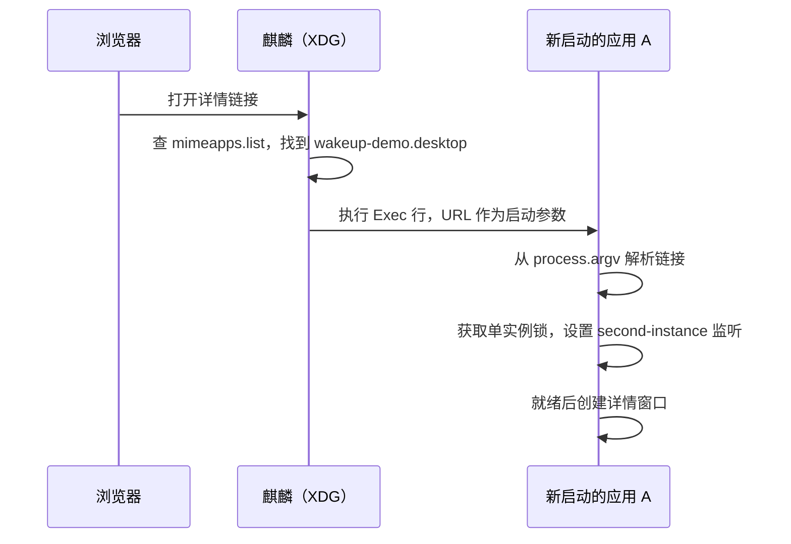
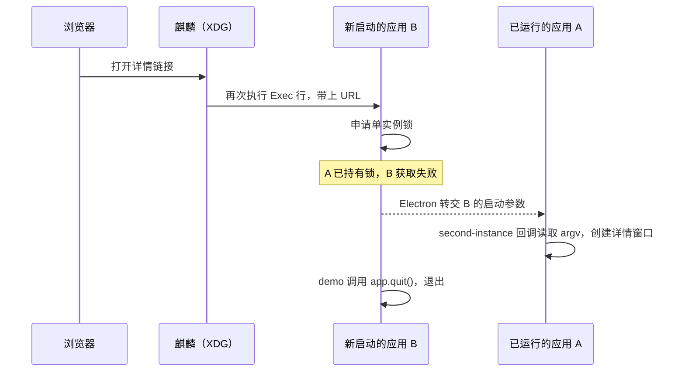

# 浏览器唤起 Electron：macOS、Windows 与 Linux 流程

以下以本 demo 的打包应用和 `wakeup-demo://app/detail` 为例，假设浏览器已允许打开链接。A、B 分别表示同一个应用先后启动的两份主进程。

## 心智模型：系统怎么找到应用

浏览器不认识 `wakeup-demo://` 这种自定义协议，必须问系统。三个平台的系统分成两派做法。



**macOS 是「管家」模型。** 系统里有个管家（LaunchServices），知道哪些应用在运行。应用安装时向它登记“我管 `wakeup-demo://`”，之后点击链接，管家**直接找到那个应用**：开着就把链接递进去，没开就替它启动。

**Windows 和 Linux 是「命令」模型。** 系统只记住一条命令——“要处理这个协议，就带上 URL 启动这个程序”。它**不关心应用是否已经在运行**，两个平台只是把这条命令存在了不同的地方：

```ini
Windows 注册表：  "<打包目录>\Wakeup Demo.exe" "%1"
Linux .desktop：  Exec=/opt/wakeup-demo/wakeup-demo %u
```

点击链接时，系统照着这条命令**跑一遍**，把 URL 填进 `%1` / `%u` 的位置。

> **关键差别**：macOS 之外的平台，系统里不存在“唤起”这个概念，存在的只是“带着一个参数去启动一个程序”。**所以每次点击都会真的启动一个新进程**。复用已有窗口这件事系统不管，必须由应用自己完成——这正是 Electron 单实例机制要解决的问题。

下面按平台展开：macOS 一条路，Windows 和 Linux 是另一条路上的两种写法。

## macOS 的完整流程

### 建立协议关联

- **声明支持的协议**：[打包配置](../apps/desktop/packaging/macos/config.js)将 `wakeup-demo` 写入应用包的 `Info.plist`。
- **注册默认关联**：手动打开一次应用，调用 `app.setAsDefaultProtocolClient(SCHEME)`，让系统遇到该协议时选择这个应用。

### 应用未运行时



[`open-url`](https://www.electronjs.org/docs/latest/api/app#event-open-url-macos) 可能在 `ready` 前到达，所以要提前监听；尚未就绪时先保存到 `pendingPage`，就绪后再创建窗口。

### 应用已运行时



常规系统协议唤起直接复用 A，通过 `open-url` 交付新链接。

## Windows 的完整流程

### 注册启动命令

手动打开一次打包应用，调用 `app.setAsDefaultProtocolClient(SCHEME)`。Windows 将协议与下面的启动命令关联，保存在注册表中：

```text
"<打包目录>\Wakeup Demo.exe" "%1"
```

`%1` 代表完整 URL。**按照本 demo 的注册方式，每次打开协议链接，Windows 都会执行这条命令，启动一份应用实例。** 已有应用接手请求的过程由 Electron 的单实例机制完成。

### 应用未运行时



此时只有 A，链接直接从自己的 `process.argv` 读取，不会触发 `second-instance`。

### 应用已运行时

A 已持有单实例锁，并设置好监听。再次点击链接，Windows 会启动同一个 `.exe` 的另一份主进程 B；这就是“第二个进程”。



**监听提前设置在 A 中；B 后来调用 [`requestSingleInstanceLock()`](https://www.electronjs.org/docs/latest/api/app#apprequestsingleinstancelockadditionaldata)，才触发 A 的回调。** 窗口由 A 创建，B 在转交参数后退出，两者可以交错进行。新链接从回调的 `argv` 读取，A 自己的 `process.argv` 不会随之更新。

## Linux 的完整流程

Linux 覆盖麒麟、统信 UOS 等国产化系统。**国产化系统在技术上就是 Linux**，并不是第三套机制：走的仍是上面那条「命令」模型的路，只是换了桌面环境、预装浏览器与打包格式。下面这套写法在麒麟和 UOS 上通用。

### 建立协议关联

安装 `.deb` 时，把 `.desktop` 文件放进 `/usr/share/applications/`（权限须为 `644`，其他权限会被系统忽略）。系统据此在 `mimeapps.list` 中记下 `wakeup-demo://` 与这个 `.desktop` 的对应关系。

打包脚本同时会执行 `update-desktop-database` 刷新数据库；这一步由 `desktop-file-utils` 的 dpkg 触发器自动完成，无需自己写 `postinst`。注册**立即生效，不需要注销或重启**。

### 应用未运行时



与 Windows 相同：此时只有 A，链接直接从自己的 `process.argv` 读取，不会触发 `second-instance`。

### 应用已运行时



系统不知道 A 已在运行，仍然照纸条启动 B；B 发现拿不到锁，把参数转交给 A 后退出。**这正是“没有管家”的直接后果**，也是 Linux 流程里唯一需要应用自己补上的环节。

### 本机验证方式

```sh
xdg-mime query default x-scheme-handler/wakeup-demo   # 查看协议关联到了哪个 .desktop
xdg-open 'wakeup-demo://app/home'                     # 等价于在浏览器点击链接
```

## 三条流程的关键差异

| 场景               | macOS                            | Windows                                                      | Linux（麒麟 / UOS）                                          |
| ------------------ | -------------------------------- | ------------------------------------------------------------ | ------------------------------------------------------------ |
| 协议关联记在哪     | `Info.plist` + LaunchServices    | 注册表中的启动命令                                           | `.desktop` 纸条 + `mimeapps.list`                            |
| 应用未运行         | 启动 A，通过 `open-url` 交付链接 | 启动 A，从自身 `process.argv` 读取链接                       | 启动 A，从自身 `process.argv` 读取链接                       |
| 应用已运行         | 系统直接向 A 交付 `open-url`     | 系统先启动 B，Electron 再把参数交给 A 的 `second-instance`   | 系统先启动 B，Electron 再把参数交给 A 的 `second-instance`   |
| 应用需要处理的入口 | `open-url`，注意就绪时机         | 冷启动读 `process.argv`，再次唤起读 `second-instance` 的参数 | 冷启动读 `process.argv`，再次唤起读 `second-instance` 的参数 |

**Windows 与 Linux 的流程完全一致**，区别只在协议关联的存放位置；真正独树一帜的是 macOS——它有管家，系统自己负责“找到并交付给已运行的应用”。

对应代码在[主进程](../apps/desktop/src/main.js)。三个平台拿到链接后，都交给[共享协议包](../packages/deep-link/src/index.js)解析，再由 `openWindow(page)` 新建对应窗口。
