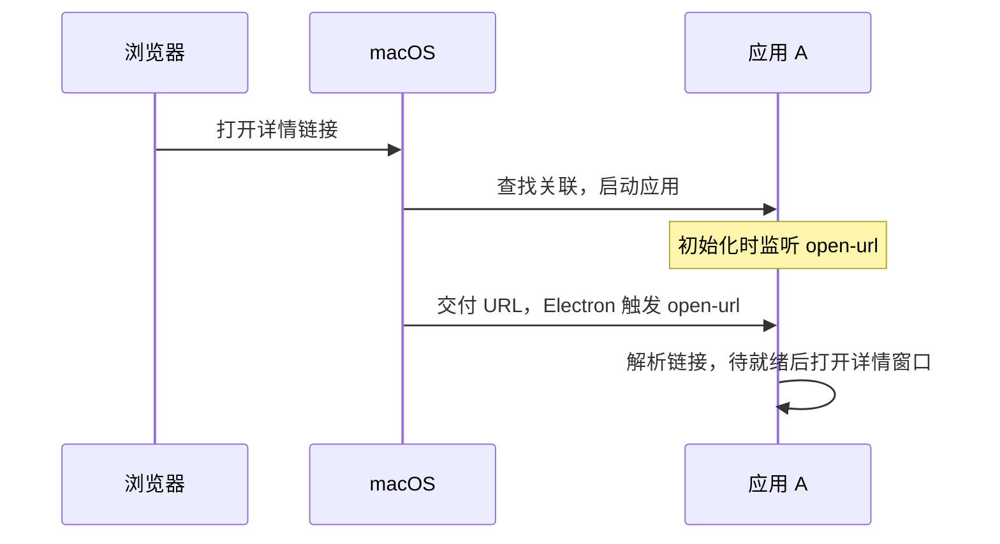
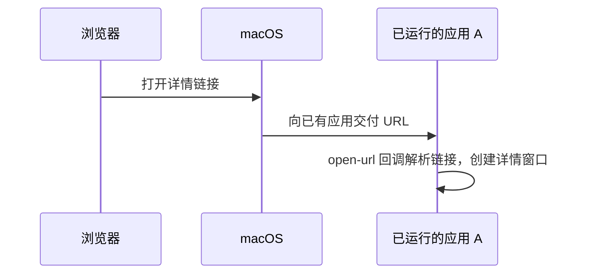
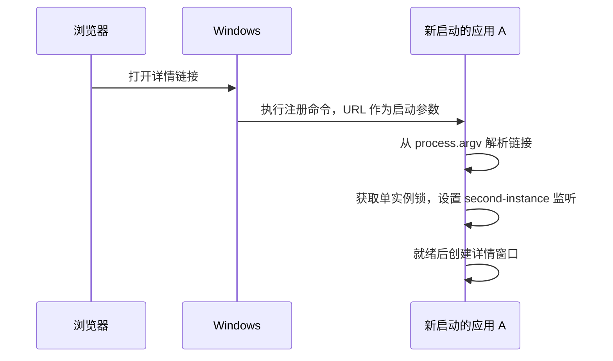
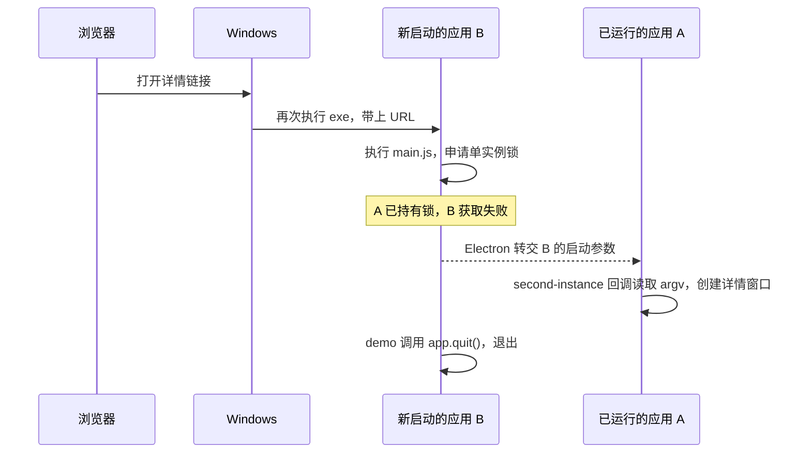

# 浏览器唤起 Electron：macOS 与 Windows 流程

以下以本 demo 的打包应用和 `wakeup-demo://app/detail` 为例，假设浏览器已允许打开链接。A、B 分别表示同一个应用先后启动的两份主进程。

## macOS 的完整流程

### 建立协议关联

- **声明支持的协议**：[打包配置](../apps/desktop/packaging/macos/config.js)将 `wakeup-demo` 写入应用包的 `Info.plist`。
- **注册默认关联**：手动打开一次应用，调用 `app.setAsDefaultProtocolClient(SCHEME)`，让系统遇到该协议时选择这个应用。

### 应用未运行时



[`open-url`](https://www.electronjs.org/docs/latest/api/app#event-open-url-macos) 可能在 `ready` 前到达，所以要提前监听；尚未就绪时先保存到 `pendingPage`，就绪后再创建窗口。

### 应用已运行时



常规系统协议唤起直接复用 A，通过 `open-url` 交付新链接。

## Windows 的完整流程

### 注册启动命令

手动打开一次打包应用，调用 `app.setAsDefaultProtocolClient(SCHEME)`。Windows 将协议与下面的启动命令关联，保存在注册表中：

```text
"<打包目录>\Wakeup Demo.exe" "%1"
```

`%1` 代表完整 URL。**按照本 demo 的注册方式，每次打开协议链接，Windows 都会执行这条命令，启动一份应用实例。** 已有应用接手请求的过程由 Electron 的单实例机制完成。

### 应用未运行时



此时只有 A，链接直接从自己的 `process.argv` 读取，不会触发 `second-instance`。

### 应用已运行时

A 已持有单实例锁，并设置好监听。再次点击链接，Windows 会启动同一个 `.exe` 的另一份主进程 B；这就是“第二个进程”。



**监听提前设置在 A 中；B 后来调用 [`requestSingleInstanceLock()`](https://www.electronjs.org/docs/latest/api/app#apprequestsingleinstancelockadditionaldata)，才触发 A 的回调。** 窗口由 A 创建，B 在转交参数后退出，两者可以交错进行。新链接从回调的 `argv` 读取，A 自己的 `process.argv` 不会随之更新。

## 两条流程的关键差异

| 场景               | macOS                            | Windows                                                      |
| ------------------ | -------------------------------- | ------------------------------------------------------------ |
| 应用未运行         | 启动 A，通过 `open-url` 交付链接 | 启动 A，从自身 `process.argv` 读取链接                       |
| 应用已运行         | 系统直接向 A 交付 `open-url`     | 系统先启动 B，Electron 再把参数交给 A 的 `second-instance`   |
| 应用需要处理的入口 | `open-url`，注意就绪时机         | 冷启动读 `process.argv`，再次唤起读 `second-instance` 的参数 |

对应代码在[主进程](../apps/desktop/src/main.js)。两平台拿到链接后，都交给[共享协议包](../packages/deep-link/src/index.js)解析，再由 `openWindow(page)` 新建对应窗口。
