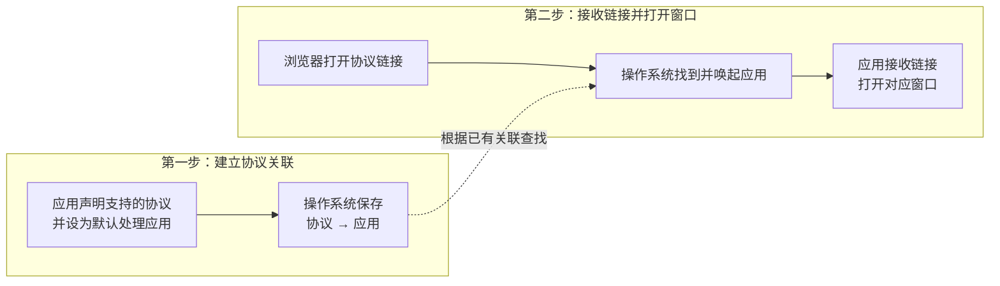

# 浏览器唤起 Electron：核心只有两步



## 第一步：建立协议与应用的关联

先声明应用支持处理的协议，再将应用设为该协议的默认处理应用。

[macOS 打包配置](../apps/desktop/packaging/macos/config.js)声明 `wakeup-demo`，打包工具将其写入应用的 `Info.plist`：

```js
protocols: [{ name: 'Wakeup Demo Link', schemes: ['wakeup-demo'] }],
```

[主进程](../apps/desktop/src/main.js)在打包应用启动时设置默认处理应用：

```js
if (app.isPackaged) {
  app.setAsDefaultProtocolClient(SCHEME);
}
```

`SCHEME` 是 `'wakeup-demo'`。先手动打开一次打包应用，建立系统关联；应用退出后，关联仍可保留。`app.isPackaged` 只表示是否为打包应用，不表示是否已注册，因此这段代码每次启动打包应用都会执行。

## 第二步：应用接收链接，打开对应窗口

关联建立后，浏览器负责发起打开请求，操作系统负责找到应用，应用自己决定打开哪个窗口。

macOS 通过 `open-url` 事件交付完整 URL。本 demo 不处理查询参数，只识别两个固定链接：

| 链接                       | 窗口加载的文件 |
| -------------------------- | -------------- |
| `wakeup-demo://app/home`   | `home.html`    |
| `wakeup-demo://app/detail` | `detail.html`  |

[主进程](../apps/desktop/src/main.js)接收链接，由共享包的 `parseDeepLink()` 返回 `'home'`、`'detail'` 或 `null`：

```js
app.on('open-url', (event, url) => {
  event.preventDefault();
  const page = parseDeepLink(url);

  if (!page) {
    return;
  }

  if (app.isReady()) {
    openWindow(page);
  } else {
    pendingPage = page;
  }
});
```

系统可能在 Electron 就绪前交付启动链接，因此提前监听；未就绪时暂存目标，`app.whenReady()` 中再打开它。手动启动没有目标链接时，默认打开首页。

`openWindow()` 的核心就是创建窗口并加载对应文件：

```js
const window = new BrowserWindow({ width: 640, height: 480 });
window.loadFile(path.join(__dirname, `${page}.html`));
```

上面省略了源码中的窗口安全配置。每次点击都会新建一个对应窗口。页面只展示静态 HTML，不需要 preload、IPC 或页面内路由；主进程根据链接直接决定加载哪个文件。
